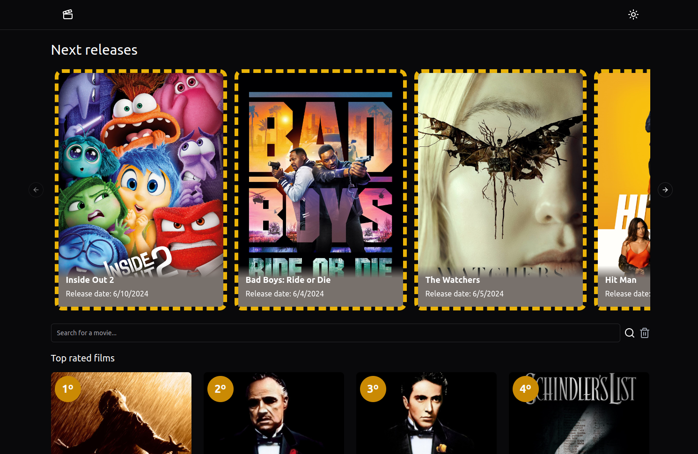
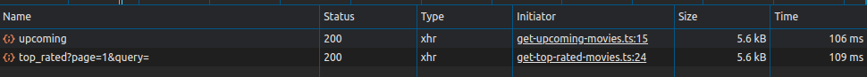
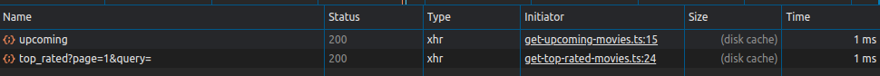

# React Movie Database



## About
A movie database project featuring a carousel with upcoming releases, top-rated movies, and a search field for the desired film. It also includes a movie details page showing the main information about the movie and its cast. All of this is integrated with the [TMDB API](https://developer.themoviedb.org/reference/intro/getting-started).

### Stack
The project is built with [React](https://react.dev/), along with [TailwindCSS](https://tailwindcss.com/docs/installation), [Shadcn/ui](https://ui.shadcn.com/), [React Router](https://reactrouter.com/en/main), and React Query. Special mention goes to React Query, which optimizes repeated calls through its caching mechanism. For more information about it, check out the [documentation](https://tanstack.com/query/latest/docs/framework/react/overview).

**Comparison of requests using `react-query`**

First API call:


Same call with cache:


## Project Structure

- [x] Project Structure
- [x] Eslint Configuration
- [x] Configure Tailwind and shadcn/ui
- [x] Default Layout
- Components
  - [x] Header
  - [x] Background Carousel for Latest Released Movies
  - [x] Search Form
  - [x] Movie List
  - [x] Pagination
- Pages
  - [x] Home
  - [x] Movie Details
- [x] Page Navigation

## How to Run Locally
After cloning the project, navigate to the project directory and install the project dependencies using your package manager.

|||
|---|---|
| pnpm | `pnpm install`|
| yarn | `yarn install`|
| npm | `npm install`|

Create an environment variables file named .env.local and add the following environment variables:
```
VITE_API_READ_ACCESS_TOKEN=
VITE_BASE_TMDB_URL=
VITE_IMG_BASE_URL=
```

> An [API Key](https://developer.themoviedb.org/reference/intro/authentication) must be configured for authorization to access the APIs.

With the environment variables set and the packages installed, simply run the following command:
|||
|---|---|
| pnpm | `pnpm dev`|
| yarn | `yarn dev`|
| npm | `npm run dev`|